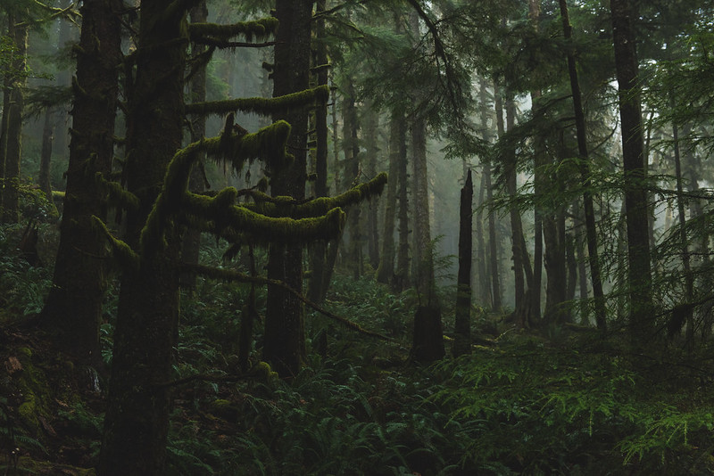

# Is Oregon Becoming Less Rainy?
## Luke Coury
**November 23rd, 2021**
\hfill\break

.jpg)

Rain is an integral part of Oregon's ecosystem. It is therefore a pressing question how a changing global climate will affect Oregon's precipitation. Anecdotally, it appears like Oregon is becoming dryer over time. In my lifetime, it has seemed like droughts and wildfires have become more frequent and severe. In my mind, this would imply that Oregon is becoming less rainy. To explore this topic, I will analyze precipitation trends over the last century in three main areas:
\hfill\break
\hfill\break
**1. Trends in total precipitation in Oregon.**
\hfill\break
\hfill\break
**2. Trends across seasons and climate regions.**
\hfill\break
\hfill\break
**3. Trends in *how* precipitation is falling.**
\hfill\break
\hfill\break
Analyzing these three areas will provide a solid understanding of how, or if, Oregon's precipitation has changed over the last century.


\newpage
# 1. High-Level Precipitation Trends in Oregon

The first area of focus is also the simplest to analyze. I want to understand how precipitation in Oregon as a whole has changed over the last century. My initial assumption was that I should observe a downward trend in precipitation levels over time. This assumption would line up with the anecdotal evidence that a dryer Oregon is making wildfires and droughts more severe. To make this analysis, I used data compiled by the National Oceanic and Atmospheric Administration (NOAA). Using this data, I was able to graph a scatter plot of total monthly precipitation over the last century and then find a trend line: 


<!-- -->
The trend line in this graph contradicts my assumption. Rather than a downward trend in monthly precipitation, there is a flat or slightly positive trend over the last century.


As shown in the table below, the trend in precipitation in Oregon in the last century is around a positive 0.001 inches per year. Note, that this trend is not statistically significant. So it is impossible to say with certainty whether or not this is a non-zero trend.


```
## 
## <table style="text-align:center"><caption><strong>Annual Oregon Precipitation Trend Since 1921</strong></caption>
## <tr><td colspan="2" style="border-bottom: 1px solid black"></td></tr><tr><td style="text-align:left"></td><td><em>Dependent variable:</em></td></tr>
## <tr><td></td><td colspan="1" style="border-bottom: 1px solid black"></td></tr>
## <tr><td style="text-align:left"></td><td>Precipitation in Inches</td></tr>
## <tr><td colspan="2" style="border-bottom: 1px solid black"></td></tr><tr><td style="text-align:left">Annual Trend</td><td>0.001</td></tr>
## <tr><td style="text-align:left"></td><td>(0.001)</td></tr>
## <tr><td style="text-align:left"></td><td></td></tr>
## <tr><td colspan="2" style="border-bottom: 1px solid black"></td></tr><tr><td style="text-align:left">Observations</td><td>1,209</td></tr>
## <tr><td colspan="2" style="border-bottom: 1px solid black"></td></tr><tr><td style="text-align:left"><em>Note:</em></td><td style="text-align:right"><sup>*</sup>p<0.1; <sup>**</sup>p<0.05; <sup>***</sup>p<0.01</td></tr>
## </table>
```
The main take away from the graph and Table 1 is that the trend in Oregon precipitation has been quite flat over the last century. This trend seems to challenge the perception of a dryer Oregon. This raises the obvious question, can Oregon truly be getting dyer if there seems to be virtually no change in precipitation over the last century? But if Oregon is not seeing a sizable change in precipitation, what explains the increase in wildfires? This high-level overview reveals that a more detailed analysis of trends within Oregon was warranted which I will explore in the second area of focus.


\newpage
# 2. Seasonal and Regional Precipitation Trends

It is important to note that there are a number of factors which cause variation in precipitation levels within Oregon which are not captured by viewing Oregon as a whole. Two such factors which I will consider are seasonal and regional variation within the state. 


## Seasonality and Precipitation
Oregon experiences considerable seasonality in precipitation levels. To capture the effects on seasonality on precipitation levels, I divided the Oregon precipitation data by season. I assigned seasonal cutoffs to calendar seasons (i.e. December, January, and February constitute winter months, March, April and May constitute spring months, etc.). Clearly this calendar cutoff is somewhat arbitrary and will not perfectly capture true seasonality. Even so, it will still provide important insight into Oregon's precipitation. 
<!-- -->
As with the more general Oregon graph, the seasonal trend lines are fairly flat with the possible exception of the spring trend.

\newpage
The point estimates of the annual trends are listed in the table below.


\begin{table}[!htbp] \centering 
  \caption{Oregon Precipitation Trends by Season Since 1921} 
  \label{} 
\begin{tabular}{@{\extracolsep{5pt}}lcccc} 
\\[-1.8ex]\hline 
\hline \\[-1.8ex] 
 & \multicolumn{4}{c}{\textit{Dependent variable:}} \\ 
\cline{2-5} 
\\[-1.8ex] & \multicolumn{4}{c}{Precipitation in Inches} \\ 
 & Fall & Winter & Spring & Summer \\ 
\hline \\[-1.8ex] 
 Annual Trend & $-$0.0004 & 0.0004 & 0.006$^{**}$ & $-$0.0005 \\ 
  & (0.003) & (0.004) & (0.002) & (0.001) \\ 
  & & & & \\ 
\hline \\[-1.8ex] 
Observations & 301 & 302 & 303 & 303 \\ 
\hline 
\hline \\[-1.8ex] 
\textit{Note:}  & \multicolumn{4}{r}{$^{*}$p$<$0.1; $^{**}$p$<$0.05; $^{***}$p$<$0.01} \\ 
\end{tabular} 
\end{table} 
Table 2 shows that only spring trend is significantly different from zero. I can conclude, therefore, that there has not been a significant change in the precipitation trends for summer, fall or winter. The annual trend for spring, on the other hand, is robust enough to be statistically significant at the 5% level. The trend shows that springs are getting higher levels of precipitation over time.
\hfill\break
\hfill\break
Analyzing seasonal trends shows that, even when divided by season, Oregon has not experienced a downward annual trend in precipitation. In fact, there is a robust positive precipitation trend for spring. These findings also seem to contradict the perception of a dryer Oregon. However, seasonal trends still do not consider all the possible precipitation variation in Oregon. To get a fuller picture, I also look at precipitation trends in Oregon's sub-climates.


\newpage
## Climate Divisions and Precipitation
Oregon is a climatologically diverse state with significantly regional variation in precipitation. To account for this variation, NOAA divides the state into nine climate divisions designated by the numbers 1 through 9. Even these climate divisions are too broad to capture the full range of climate diversity. However, analyzing trends in each region should provide a picture into how, or if, precipitation trends differ between different climates. Before analyzing the trends, it is important to understand how precipitation varies among these climate divisions by looking at average monthly precipitation levels.

<!-- -->
In this map we can see the significant variation in average precipitation by climate division. Broadly, divisions west of the Cascade Mountains, or divisions 1-4 which are the Coast, Willamette Valley, Southwestern Valley, and Northern Cascades respectively, received higher levels of precipitation than the divisions east of the cascade mountains. Divisions 5-9 which are the High Plateau, North Central, South Central, North East, and South East respectively, are considerably more arid than the western part of the state. This phenomena is called the rain shadow effect. 

\newpage
Given the significant precipitation variation among climate divisions, I was curious if these divisions also had differences in precipitation trends over the last century. To answer this question, I found the trend in average monthly precipitation for each climate division, controlling for seasonality.

<!-- -->
We can see that there are indeed differing trends among climate regions. In general, this graph shows that there is a difference in trend between the wetter climates west of the cascades and the dryer climates in the eastern rain shadow of the cascades. The wetter climate divisions appear to have higher trends in precipitation than the more arid climate divisions.


\newpage
The point estimates of these trends, however, show that precipitation has been fairly consistent for all climate division. Table 3 looks at the annual trend by climate division for the four climate divisions west of the Cascade Mountains over the last century. Table 4 lists the annual trends in the five climate divisions east of the Cascade Mountains over the last century

\begin{table}[!htbp] \centering 
  \caption{Precipitation Trends For Divisions West of Cascades Since 1921} 
  \label{} 
\begin{tabular}{@{\extracolsep{5pt}}lcccc} 
\\[-1.8ex]\hline 
\hline \\[-1.8ex] 
 & \multicolumn{4}{c}{\textit{Dependent variable:}} \\ 
\cline{2-5} 
\\[-1.8ex] & \multicolumn{4}{c}{Precipitation in Inches} \\ 
 & (1) Coast & (2) Willamette V. & (3) S.Western V. & (4) N. Cascades \\ 
\hline \\[-1.8ex] 
 Annual Trend & 0.003 & 0.003 & 0.001 & 0.004 \\ 
  & (0.004) & (0.003) & (0.002) & (0.003) \\ 
  & & & & \\ 
\hline \\[-1.8ex] 
Observations & 1,209 & 1,209 & 1,209 & 1,209 \\ 
\hline 
\hline \\[-1.8ex] 
\textit{Note:}  & \multicolumn{4}{r}{$^{*}$p$<$0.1; $^{**}$p$<$0.05; $^{***}$p$<$0.01} \\ 
\end{tabular} 
\end{table} 
\hfill\break

\begin{table}[!htbp] \centering 
  \caption{Precipitation Trends For Divisions East of Cascades Since 1921} 
  \label{} 
\begin{tabular}{@{\extracolsep{5pt}}lccccc} 
\\[-1.8ex]\hline 
\hline \\[-1.8ex] 
 & \multicolumn{5}{c}{\textit{Dependent variable:}} \\ 
\cline{2-6} 
\\[-1.8ex] & \multicolumn{5}{c}{Precipitation in Inches} \\ 
 & (5) High Plateau & (6) N. Central & (7) S. Central & (8) N. East & (9) S. East \\ 
\hline \\[-1.8ex] 
 Annual Trend & 0.002 & 0.001 & 0.001 & 0.001 & 0.001$^{*}$ \\ 
  & (0.001) & (0.001) & (0.001) & (0.001) & (0.001) \\ 
  & & & & & \\ 
\hline \\[-1.8ex] 
Observations & 1,209 & 1,209 & 1,209 & 1,209 & 1,209 \\ 
\hline 
\hline \\[-1.8ex] 
\textit{Note:}  & \multicolumn{5}{r}{$^{*}$p$<$0.1; $^{**}$p$<$0.05; $^{***}$p$<$0.01} \\ 
\end{tabular} 
\end{table} 
\hfill\break
The trends in Table 3 are all positive and none are significantly different from zero. We can conclude that the trends in western climate divisions are essentially flat. Table 4 displays mostly similar trends. None of the trends are statistically significant at the 5% level. However, the trend in the South Eastern is statistically significant at the 10% level. As a whole, precipitation trends in all climate divisions have been essentially flat over the last century. Again, this seem to contradict my assumption that Oregon is getting dyer.
\newpage

## Seasonal Trends in Eastern and Western Oregon

Having established how precipitation and precipitation trends vary by seasonality and climate division, I will now examine if seasonal precipitation trends show regional variation. As stated earlier, Oregon's climate divisions can be broadly separated into the arid rain shadow east of the cascades, and the wetter area west of the cascades. To get a broad overview of how seasonality and climate variation interact, I grouped climate divisions accordingly into Eastern and Western Oregon and estimated seasonal trends as shown below.


\begin{table}[!htbp] \centering 
  \caption{Seasonal Precipitation Trends For Divisions West of Cascades Since 1921} 
  \label{} 
\begin{tabular}{@{\extracolsep{5pt}}lcccc} 
\\[-1.8ex]\hline 
\hline \\[-1.8ex] 
 & \multicolumn{4}{c}{\textit{Dependent variable:}} \\ 
\cline{2-5} 
\\[-1.8ex] & \multicolumn{4}{c}{Precipitation in Inches} \\ 
 & West Winter & West Spring & West Summer & West Fall \\ 
\hline \\[-1.8ex] 
 Annual Trend & 0.00001 & 0.010$^{***}$ & 0.0003 & 0.001 \\ 
  & (0.005) & (0.003) & (0.001) & (0.003) \\ 
  & & & & \\ 
\hline \\[-1.8ex] 
Observations & 1,208 & 1,212 & 1,212 & 1,204 \\ 
\hline 
\hline \\[-1.8ex] 
\textit{Note:}  & \multicolumn{4}{r}{$^{*}$p$<$0.1; $^{**}$p$<$0.05; $^{***}$p$<$0.01} \\ 
\end{tabular} 
\end{table} 
\hfill\break

\begin{table}[!htbp] \centering 
  \caption{Seasonal Precipitation Trends For Divisions East of Cascades Since 1921} 
  \label{} 
\begin{tabular}{@{\extracolsep{5pt}}lcccc} 
\\[-1.8ex]\hline 
\hline \\[-1.8ex] 
 & \multicolumn{4}{c}{\textit{Dependent variable:}} \\ 
\cline{2-5} 
\\[-1.8ex] & \multicolumn{4}{c}{Precipitation in Inches} \\ 
 & East Winter & East Spring & East Summer & East Fall \\ 
\hline \\[-1.8ex] 
 Annual Trend & 0.001 & 0.004$^{***}$ & $-$0.001 & $-$0.001 \\ 
  & (0.001) & (0.001) & (0.0005) & (0.001) \\ 
  & & & & \\ 
\hline \\[-1.8ex] 
Observations & 1,510 & 1,515 & 1,515 & 1,505 \\ 
\hline 
\hline \\[-1.8ex] 
\textit{Note:}  & \multicolumn{4}{r}{$^{*}$p$<$0.1; $^{**}$p$<$0.05; $^{***}$p$<$0.01} \\ 
\end{tabular} 
\end{table} 
These seasonal trends mostly mirror the broader trends of Oregon as a whole. Western Oregon has a statistically significant positive trend in spring. Eastern Oregon has a similar trend, although it is smaller in magnitude. In general it appears like Eastern and Western Oregon have experienced similar trends in seasonality as Oregon as a whole.

\newpage

# 3. Trends in Snowfall vs Rainfall
In all of my analysis so far, I have considered precipitation in all its forms. However, precipitation falling as rain if it used to fall as snow has ecological implications. *How* precipitation falls is a critical dimension of precipitation trends.
\hfill\break
\hfill\break
It is challenging to find time series data on the snowfall data for Oregon stretching as far back as a century. However, Crater Lake National Park has reliably documented the annual snowfall in the park since the 1930s. Using numbers provided by Crater Lake National Park on average annual snowfall by decade there is a clear downward trend in snowfall over the last century.

<!-- -->
This graph shows that there is a clear negative trend in snowfall in Crater Lake National Park. It is impossible to generalize snowfall in one location as indicative of Oregon as a whole. Therefore, I will be careful not to overstate the Oregon-wide implications of this Crater Lake trend. However, I think this trend can suggest something about how climate change is impacting Oregon. It is worth noting that Crater Lake is in the high plateau (climate division 5) which, as can be seen above, has not experienced a statistically significant decline in precipitation over the last century. We can conclude that, at least in Crater Lake, total precipitation has been fairly constant but more of it has been falling as rain, rather than snow.


\newpage

## Has Oregon Become Less Rainy?
On an Oregon-wide level, the answer appears to be "no". The trend in precipitation has been quite flat for the last century. Analyzing regional and seasonal variation provides valuable insights to this high-level overview. While winter, summer, and fall seem to have flat trends, spring has a statistically significant positive trend. Even if we separate Oregon into climate divisions, precipitation trends are flat. There is no indication that climates divisions have gotten significantly less precipitation over the last century. Additionally, both Eastern and Western Oregon display similar seasonal trends as Oregon as a whole. Do these trends contradict my anecdotal impression that Oregon is getting dryer? Not necessarily.
\hfill\break
\hfill\break
The negative trend in snowfall at Crater Lake could suggest a steady change in how precipitation falls in Oregon. Again, I am careful not to claim that this specific trend is necessarily indicative of all of Oregon. However, this trend does show that simply looking at precipitation as a whole misses crucial detail. A negative trend in snowpack could mean that summers are indeed getting dryer, not from a decrease in precipitation, but from a decrease in snowmelt. Although examining if Oregon has become less rainy is important, my analysis has shown that it is just as critical to consider the change in the form precipitation takes.
\hfill\break




